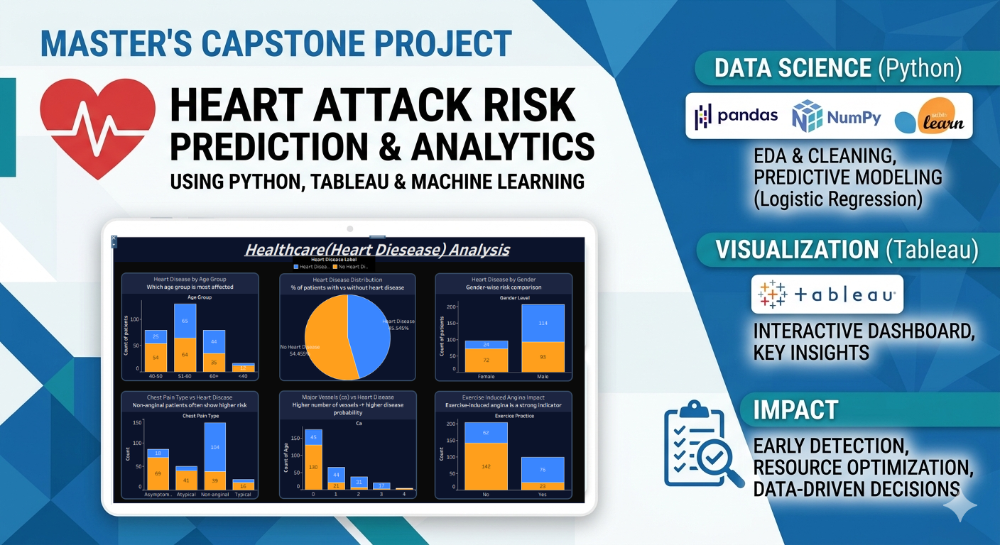

# 🏥 Healthcare-Data-Analysis-Project
End-to-end healthcare data analysis project using Python and Tableau to extract patient insights and build interactive dashboards.

---

📷 Dashboard Preview

---

# 🏥 Healthcare Analytics: Predicting Cardiovascular Disease Risk

## 📌 Project Overview
Cardiovascular diseases are a leading cause of global mortality. This project focuses on analyzing clinical data to identify significant factors contributing to heart attacks and building a predictive model to assist healthcare providers in early detection.

---

## 🎯 Problem Statement
The goal is to examine a dataset containing 14 medical attributes and over 300 clinical records to determine which factors play the most critical role in increasing the rate of heart attacks. By utilizing Machine Learning, we aim to predict the likelihood of heart disease in patients based on their medical history.

---

## 🧰 Tools & Technologies Used
* **Programming Language:** Python
* **Data Analysis:** Pandas, NumPy
* **Data Visualization:** Matplotlib, Seaborn
* **Machine Learning:** Scikit-Learn (Logistic Regression)
* **Business Intelligence:** Tableau (for Interactive Dashboarding)
* **Documentation:** Jupyter Notebook (.ipynb)

---

## 📁 Dataset Description
The project utilizes the following files:
1. `data.xlsx`: The primary dataset containing 303 patient records and 14 attributes.

2. `variable description.xlsx`: A metadata file explaining clinical terms like `trestbps` (Resting Blood Pressure), `chol` (Serum Cholesterol), and `thal` (Thalassemia).

3. `Project_Description.rtf`: The official project brief and requirements.

---

## 📊 Key Features Analyzed:
* **Age & Sex:** Demographic impact on heart health.
* **Chest Pain Type (cp):** Categorization of heart-related discomfort.
* **Max Heart Rate (thalach):** Clinical performance during stress.
* **Cholesterol (chol):** Levels of serum cholestoral in mg/dl.
* **Target:** 1 (Heart Disease Present) or 0 (Healthy).

---

## 📈 Project Workflow
1. **Data Inspection:** Checked for missing values, handled duplicates, and performed statistical summaries (Mean, Median, Std Dev).

2. **Exploratory Data Analysis (EDA):**
   * Studied the occurrence of CVD across different age groups.
   * Analyzed gender composition and its relationship with heart disease.
   * Identified anomalies in resting blood pressure.
   * Correlated cholesterol levels with the target outcome.  

3. **Predictive Modeling:** Implemented a **Logistic Regression** model to classify patients as "Healthy" or "At Risk."
4. **Model Validation:** Evaluated the model using a **Confusion Matrix** and accuracy metrics.
5. **Dashboarding:** Created a Tableau dashboard to visualize attributes of a diseased vs. a healthy person for non-technical stakeholders.

---

## 🔍 Key Insights & 💡 Learning
* **Data Cleaning:** Learned how to handle real-world clinical datasets where accuracy is critical.

* **Medical Correlation:** Discovered how variables like `thal` (Thalassemia) and `oldpeak` significantly influence cardiovascular health.

* **Model Implementation:** Gained hands-on experience in transforming raw data into a predictive tool using Scikit-Learn.

* **Business Communication:** Learned how to present complex data findings through simplified Tableau visualizations.

---

## 🏢 Impact on the Healthcare Company
* **Early Detection:** The predictive model can help hospitals flag high-risk patients earlier, potentially saving lives.

* **Resource Optimization:** Identifying key risk factors allows healthcare providers to focus resources on the most relevant diagnostic tests.

* **Data-Driven Decisions:** The Tableau dashboard provides doctors with a visual summary of patient trends, replacing manual data sorting.

---

## 🔗 Author 
**Name:** Prem Tiwary  
**Email:** premtiwary7050@gmail.com 
**LinkedIn:** www.linkedin.com/in/prem-tiwary

---

## License
This repository is for demonstration and learning purposes. Feel free to reuse the code with attribution.
